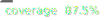

<!-- README.md -->

[](https://github.com/apiaddicts/apquality-spectral/actions/workflows/node.js.yml) 

# ApiQuality API Style Guide

This repository contains a Style Guide for OpenAPI definitions.
The Style Guide is a companion to the [ApiQuality Guidelines](https://apiquality.io), the [OpenAPI 3.0 specification](https://spec.openapis.org).

The repository also contains a [Spectral](https://github.com/stoplightio/spectral) ruleset to check
an API definition for conformance to the ApiQuality Guidelines and this Style Guide.

> **NOTE:** It is highly recommended that you leverage the Spectral rule set. ApiQuality team have found Spectral to be very useful identifying many common mistakes that affect the overall quality of their Open API documentation. It's one of the first things the API Stewardship Board turns to when reviewing an API specification.
>
> However, the errors, warnings, and info messages identified by Spectral should be evaluated in the context of *your service*, and using *your judgement*. If you have any questions, concerns, or comments, please don't hesitate to start a discussion in the [API Stewardship Teams Channel](https://github.com/apiaddicts/apquality-spectral/issues).

## How to use the Spectral Ruleset

### Dependencies

The Spectral Ruleset requires Node version 14 or later.

### Install Spectral

`npm i @stoplight/spectral-cli -g`

### Usage

You can specify the ruleset directly on the command line:

`spectral lint -r https://raw.githubusercontent.com/apiaddicts/apquality-spectral/refs/heads/main/apq-spectral.yaml <api definition file>`

Or you can create a Spectral configuration file (`.spectral.yaml`) that references the ruleset:

```yaml
extends:
  - https://raw.githubusercontent.com/apiaddicts/apquality-spectral/refs/heads/main/apq-spectral.yaml
```

### Example

```bash
spectral lint -r https://raw.githubusercontent.com/apiaddicts/apquality-spectral/refs/heads/main/apq-spectral.yaml petstore.yaml
```

### Using the Spectral VSCode extension

There is a [Spectral VSCode extension](https://marketplace.visualstudio.com/items?itemName=stoplight.spectral) that will run the Spectral linter on an open API definition file and show errors right within VSCode.  You can use this ruleset with the Spectral VSCode extension.

1. Install the Spectral VSCode extension from the extensions tab in VSCode.
2. Create a Spectral configuration file (`.spectral.yaml`) in the root directory of your project
as shown above.
3. Set `spectral.rulesetFile` to the name of this configuration file in your VSCode settings.

Now when you open an API definition in this project, it should highlight lines with errors.
You can also get a full list of problems in the file by opening the "Problems panel" with "View / Problems".  In the Problems panel you can filter to show or hide errors, warnings, or infos.

## Contributing

This project welcomes contributions and suggestions.  Most contributions require you to agree to a
Contributor License Agreement (CLA) declaring that you have the right to, and actually do, grant us
the rights to use your contribution.

When you submit a pull request, an ApiQuality team member will determine whether you need to provide
a CLA and decorate the PR appropriately (e.g., status check, comment). Simply follow the instructions
provided by the Pull Request template.

## Trademarks

This project may contain trademarks or logos for projects, products, or services. Authorized use of ApiQuality
trademarks. Any use of third-party trademarks or logos are subject to those third-party's policies.
